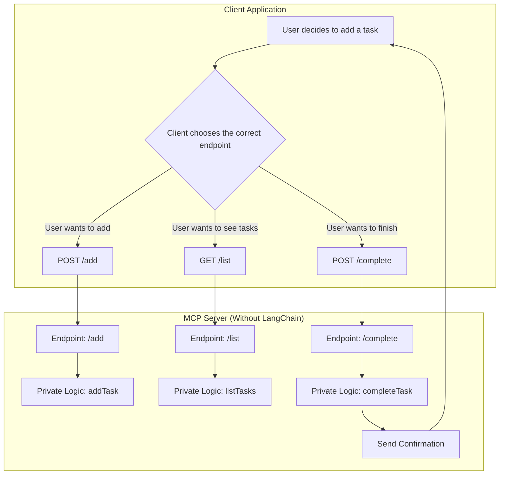

# 🧠 To-Do Assistant (MCP + Cloudflare) — No LangChain Version

This is a simple AI-powered to-do assistant that runs on Cloudflare Workers and uses the **MCP API** to understand natural language commands like:

- "Add buy milk to my to-do list"
- "Mark buy milk as completed"
- "List all tasks"

---

## 📦 Features

- Add tasks using natural language
- List current tasks
- Mark tasks as completed (by text or index)
- Deployed to Cloudflare
- MCP parses natural language to structured JSON (add / list / complete)

---

## 🛠️ Project Setup

### 1. Requirements

- Node.js (via NVM)
- Cloudflare Wrangler CLI (`npm install -g wrangler`)
- MCP API Key (from https://mcp.ai)

### 2. Install and Deploy

```bash
npx wrangler init --yes
# Replace src/index.ts with your own
npx wrangler deploy
````

---

## 🌐 API Usage

**POST** to the endpoint:

```
https://divine-grass-f8b9.hemanth-todo.workers.dev
```

### Request Body

```json
{
  "action": "add" | "list" | "complete",
  "task": "string (optional)",
  "index": number (optional)
}
```

### Actions

| Action     | Required Fields   | Description               |
| ---------- | ----------------- | ------------------------- |
| `add`      | `task`            | Adds a new task           |
| `list`     | none              | Lists all tasks           |
| `complete` | `task` or `index` | Marks a task as completed |

---

## 🔁 Example MCP Prompt → Structured Output

Input prompt:

> "Add 'Buy milk' to my to-do list"

MCP Output:

```json
{
  "action": "add",
  "task": "Buy milk"
}
```

Input prompt:

> "Mark 'Buy milk' as done"

MCP Output:

```json
{
  "action": "complete",
  "task": "Buy milk"
}
```

---

## 📊 Flowchart



---

## 🔗 Live Endpoint

> [https://divine-grass-f8b9.hemanth-todo.workers.dev](https://divine-grass-f8b9.hemanth-todo.workers.dev)

---

